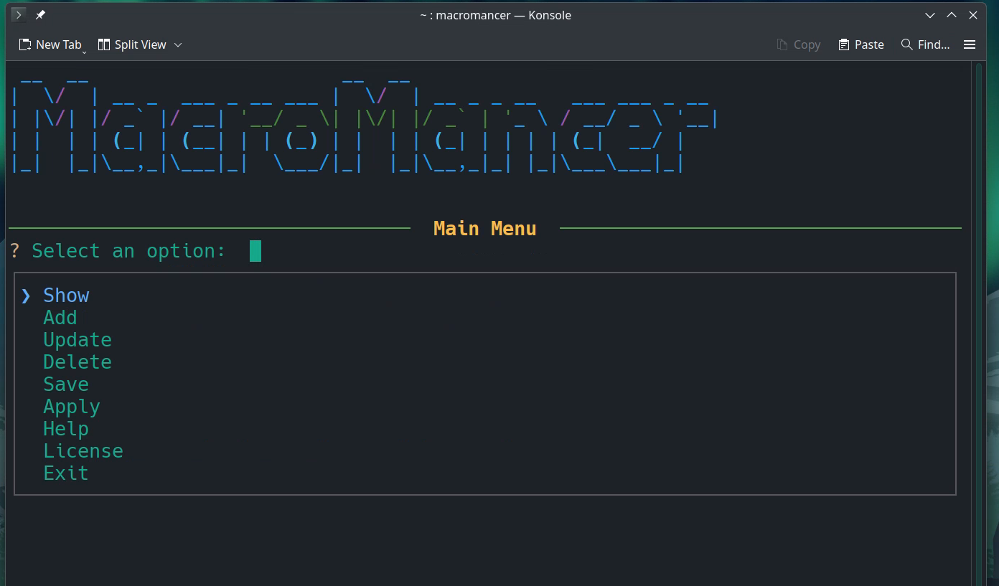
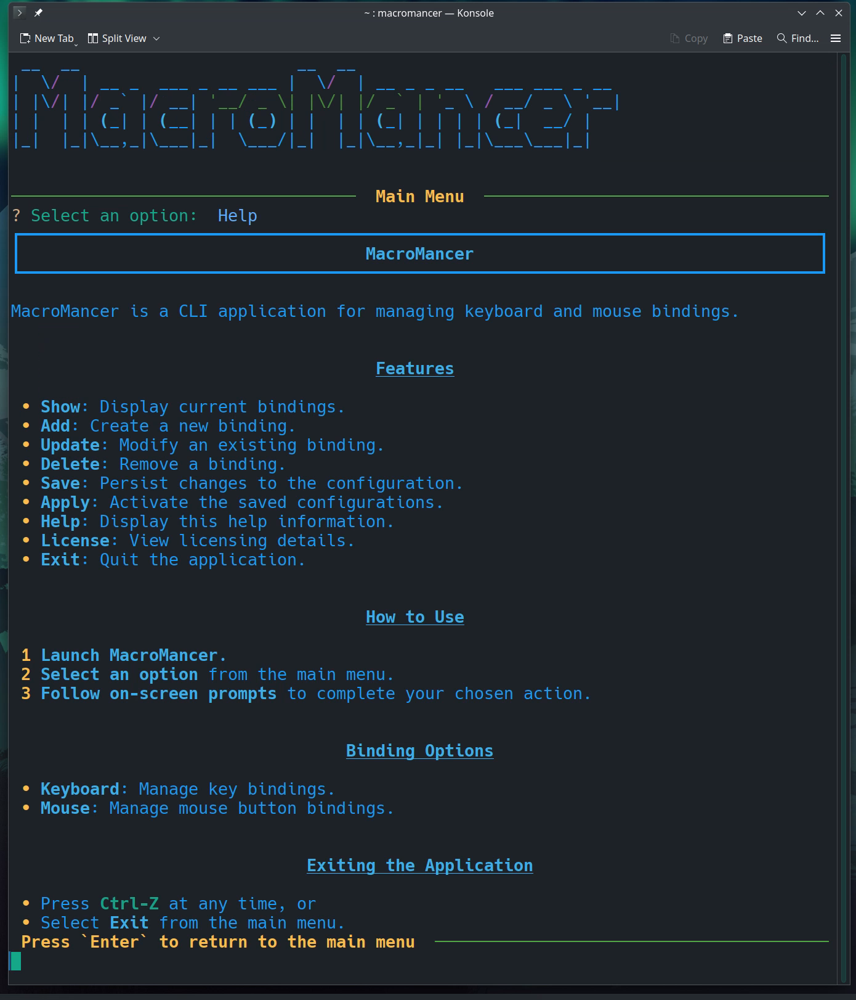
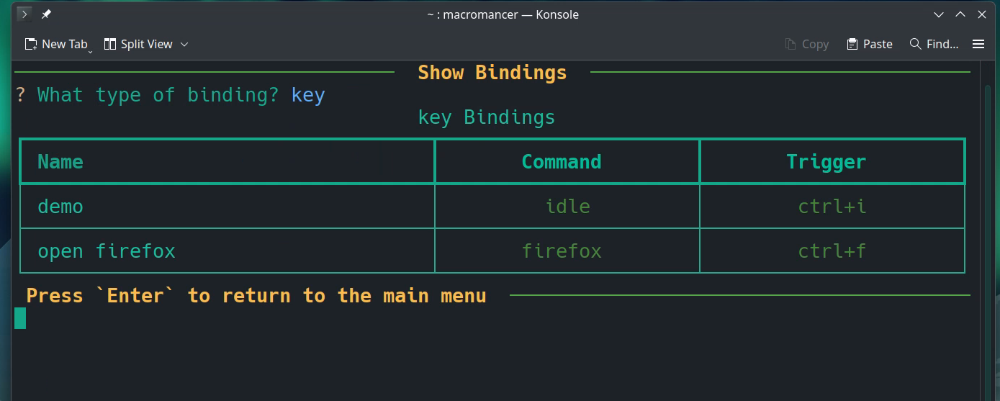
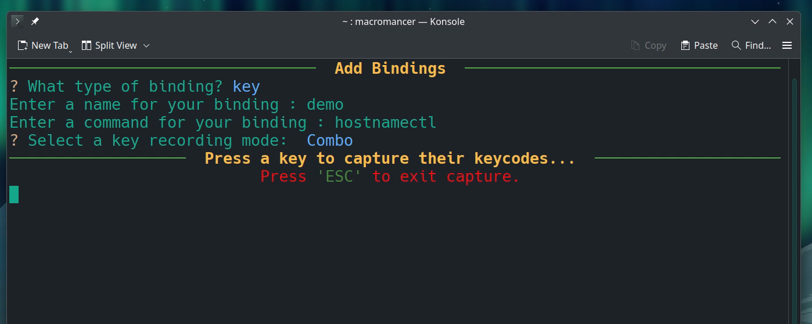

# MacroMancer

## A Linux CLI application for Keyboard and Mouse Customization.

## Table of Contents
- [Table of Contents](project-documents/table_of_contents.md)


## System Dependencies

Before installing MacroMancer, please ensure that the following system packages are installed:

- **xbindkeys**
- **xdotool**
- **x11-utils**
- **xev**

## Python Dependencies

The following packages are required by MacroMancer:

- **pyfiglet==1.0.2**
- **inquirerpy==0.3.4**
- **PyYAML==6.0.2**
- **rich==13.9.4**
- **prompt_toolkit==3.0.50**
- **pynput==1.7.7**

### Installation Instructions

Install system dependencies.

*Arch Linux / Manjaro*
```bash
sudo pacman -S xbindkeys xorg-xev xdotool gcc
```

*Debian-based*
```bash
sudo apt install xbindkeys x11-utils xdotool python3.12-venv python3-dev build-essential
```

*Fedora*
```bash
sudo dnf install xbindkeys xev xdotool gcc python3.12-devel
```

---
1. Download the the either the .tar.gz or .whl
    - If you download the .tar.gz:
        - Decompress the .tar.gz file using:
        - `tar -xvzf macromancer-0.0.1.tar.gz`
        - Then finish follow the instructions below.
    - If you downloaded the .whl file, just make make a note of the path to the download, as you will need it for the installation. 
2. After installing the necessary system dependencies create a sample .xbindkeysrc file by running:
```bash
xbindkeys -d > ~/.xbindkeysrc   # Creating a sample configuration file in    
```
3. Create a virtual environment using python:
```bash
python -m venv .venv
```
4. Activate the virtual environment:
```bash
source .venv/bin/activate
```
5. Install with Pip:
```bash
pip install /path/to/download/MacroMancer-0.0.1-py3-none-any.whl
```
6. Run MacroMancer program.
```bash
macromancer
```

### Usage
>WARNING! If you have not followed the instructions up to this point, the program will most likely not work.
> Be sure to complete all the above steps before trying to proceed to running the application. 

Run `macromancer` from the command line.
You'll be presented with the Welcome Screen, press *Enter* to continue to the Main Menu.
The Main Menu has a list of different options:
- **Show**: Display current bindings.
- **Add**: Create a new binding.
- **Update**: Modify an existing binding.
- **Delete**: Remove a binding.
- **Save**: Persist changes to the configuration.
- **Apply**: Activate the saved configurations.
- **Help**: Display this help information.
- **License**: View licensing details.
- **Exit**: Quit the application.



### Issues
If you encounter any issues please submit them in the issues tab:
[Issues](https://github.com/Alexander-N-Shelton/MacroMancer/issues)
