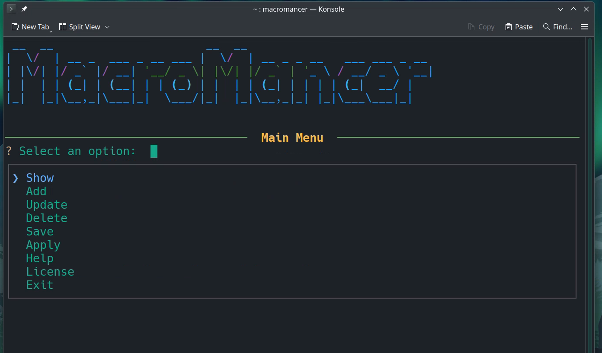
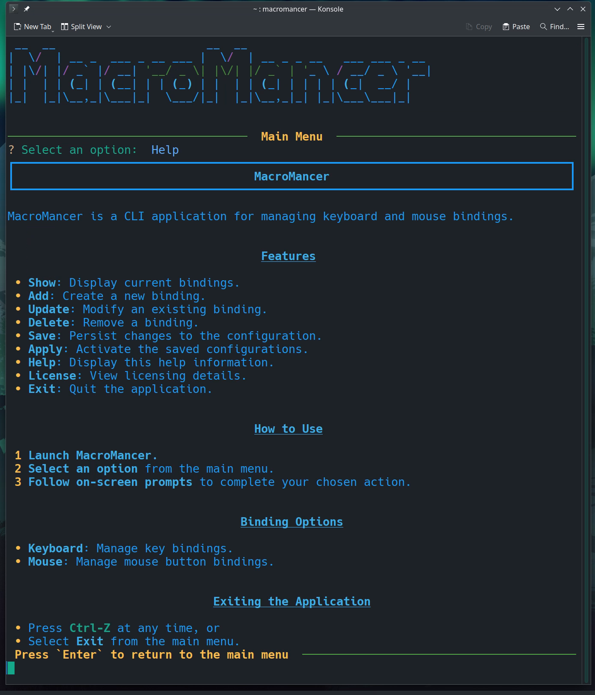
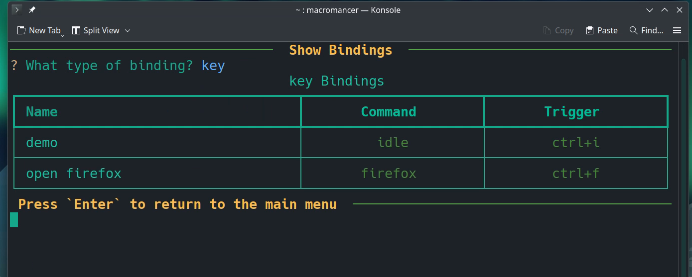
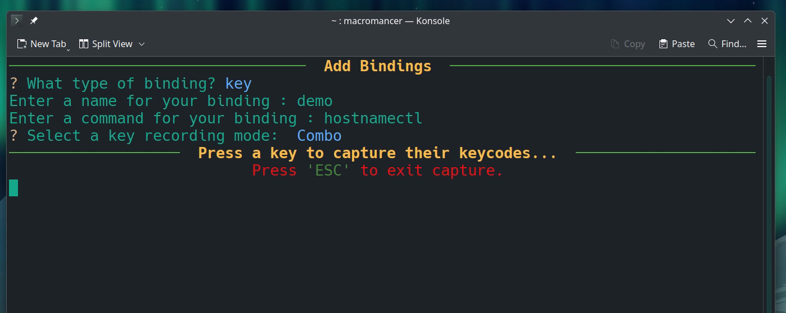

# MacroMancer Table of Contents

## MacroMancer Package

## Project Source Code

### Python Files

- [main](macromancer/main.py)
- [device_manager](macromancer/device_manager.py)
- [utils](macromancer/utils.py)
- [interactive_cli](macromancer/interactive_cli.py)
- [help](macromancer/help.py)

### Setup Files

- [pyproject](pyproject.toml)
- [setup](setup.py)
- [requirements](requirements.txt)

### Configuration Files (YAML)

- [keyboard](macromancer/config/keyboard.yaml)
- [mouse](macromancer/config/keyboard.yaml)

### Documentation

- [README](README.md)
- [help](macromancer/docs/help.md)

### License

- [License](LICENSE)

### Test

- [test_device_manager](tests/test_device_manager.py)
- [test_interactive_cli](test_interactive_cli.py)
- [test_utils](test_utils.py)

## Media

### [Click Here to Watch a Demo](assets/videos/recording_macromancer.mp4)

---

### Main Menu

---

### Help Information

---

### Show Bindings

---

### Add Bindings

---

### Backlog Items

- True macro recording/replaying
- Checking existing system shortcuts before binding keys to avoid overlapping bindings.
- Graphical user interface
